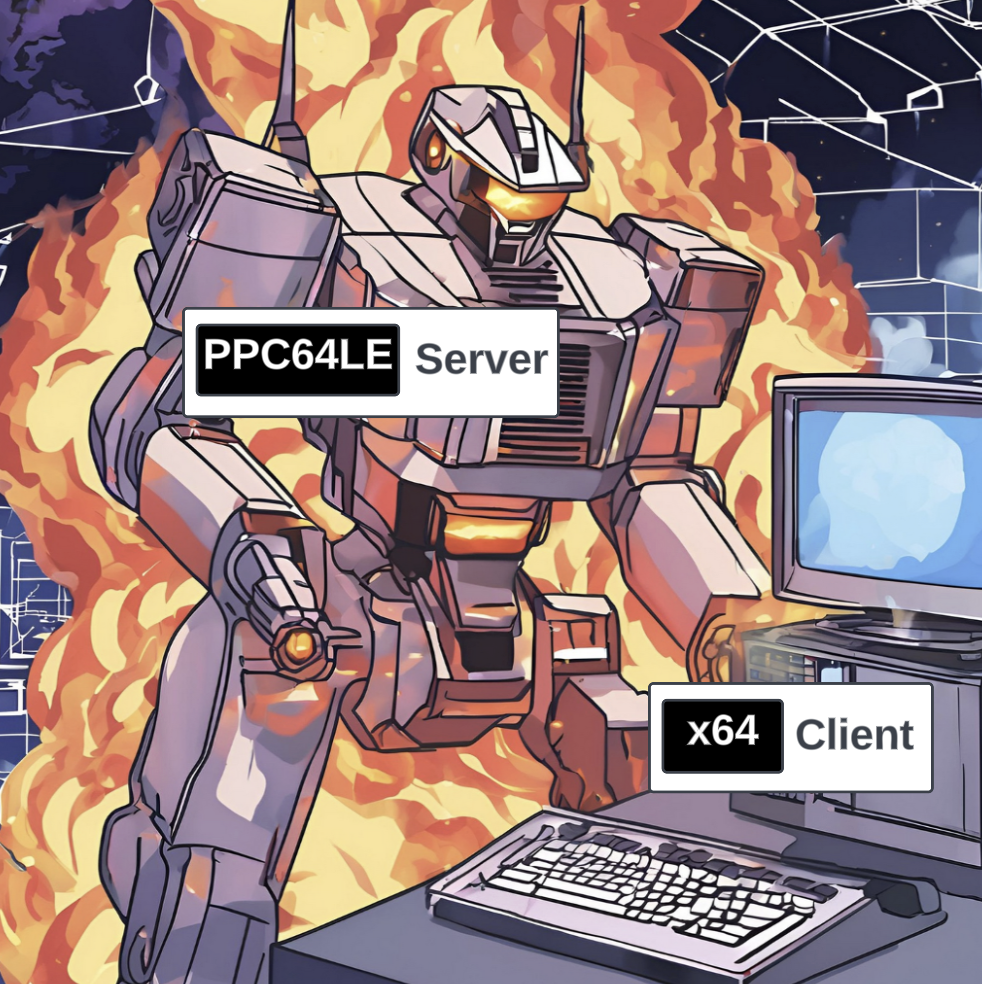

# Apache CXF JAX-RS Performance

We’ve investigated [Apache CXF Soap
Performance](https://github.com/savoirtech/apache-cxf-soap-performance)
in our testing lab, now its time to focus on JAX-RS. We’ll be using the
same systems, so we’ll get to see the through-put difference between
these approaches.

We’ll also get to see some of the config and tuning required to ready
the systems to stably run the performance suite.

<figure>

</figure>

# The Setup

<figure>

</figure>

For our lab test we’ll be using the following hardware:

- Dell PowerEdge R250

  - Intel Xeon E-2378 (8c, 16t)

  - 128 GB DDR4 RAM

  - 1 Gigabit Ethernet

  - Ubuntu 22.04 LTS

- Raptor Blackbird

  - IBM POWER9 v2 SMT4 Sforza (8c, 32 t)

  - 128 GB DDR4 RAM

  - 1 Gigabit Ethernet

  - CentOS Stream 9

- Dell PowerConnect 2808 (network switch)

The machines are co-located on the same switch, reducing the number of
packet hops.

# The Performance Harness

As of CXF 4.1 the binary distribution will contain a set of performance
scripts in the samples folder. Options to test JAX-WS and JAX-RS are
present.

<figure>

</figure>

At its core, the performance harness is a client-server request/response
automation. On startup the script initializes and warms up the JVM for
executing mass calls.

## How it works

The client host runs a number of threads, each running a CXF client
which calls the server host. For JAX-RS testing, we have a choice of
calling using a verb (GET, POST, PUT, DELETE). The client side harness
will run N threads for M times for the specified duration.

<figure>

</figure>

Once the time duration has been met, it will cease the executing
clients, and tabulate the total calls.

# Theory Time!

In our previous performance lab we were attempting to achieve 1 Billion
invocations in an eight-hour period. Let’s see what JAX-RS can do.

Before we start our labs we shall run a few 60-second quick tests to
dial in client counts for our systems (x64 client → PPC64LE server,
PPC64LE client → x64 server).

| Clients | Target Calls/Second per client | Quick Test (Reality) Calls Per Second Per Thread on x64 client | Quick Test (Reality) Calls Per Second Per Thread on PPC64LE client |
|----|----|----|----|
| 1 | 34722.2 | 1338.6 | 665.55 |
| 8 | 4340.27 | 2386.96 | 2325.85 |
| 16 | 2170.14 | 1728.17 | 1694.91 |
| 32 | 1085.07 | ***1414.77*** | 867.71 |
| 64 | 542.53 | ***852.64*** | 470.66 |
| 128 | 271.27 | ***510.38*** | 229.56 |
| 256 | 135.63 | ***237.67*** (sweet spot) | 117.10 |
| 512 | 67.81 | ***116.97*** | 57.68 |
| 1024 | 33.90 | ***59.10*** | 32.07 |
| 2048 | 16.95 | ***30.58*** | ***16.98*** (best fit) |

<table>
<colgroup>
<col style="width: 50%" />
<col style="width: 50%" />
</colgroup>
<thead>
<tr>
<th style="text-align: center;">PPC64LE</th>
<th style="text-align: center;">X64</th>
</tr>
</thead>
<tbody>
<tr>
<td style="text-align: left;"><figure>

</figure></td>
<td style="text-align: left;"><figure>

</figure></td>
</tr>
<tr>
<td style="text-align: left;"><p>When running PPC64LE as the server-side
we hope to achieve 60843.52 calls per second (256 threads * 237.67 =
60843.52).</p></td>
<td style="text-align: left;"><p>When running x64 as the server-side we
hop to achieve 34775.04 calls per second (2048 threads * 16.98 =
34775.04).</p></td>
</tr>
<tr>
<td style="text-align: left;"><p>1,752,293,376 projected eight-hour
served request goal.</p></td>
<td style="text-align: left;"><p>1,001,521,152 projected eight-hour
served request goal.</p></td>
</tr>
</tbody>
</table>

# Lets get this test case running

To run the performance harness we change directory into samples. Within
this folder we’ll build the base harness and the various scenarios.

On each host we will open a terminal to the CXF distribution samples
folder.

We’ll ensure we have JAVA_HOME and MAVEN_HOME environment variables set.

For our first run we’ll use Adoptium Eclipse Temurin 17 LTS as Client
and Server side JVM.

We set our Heap size to 8GB.

``` bash
MAVEN_OPTS="-Xms32m -Xmx8192m -Dmaven.artifact.threads=5"
```

``` bash
$ cd samples
$ mvn clean install
$ cd performance/jaxrs
```

On the Server host we’ll execute the following maven profile:

``` bash
$mvn -Pserver -Dhost=0.0.0.0 -Dprotocol=http
```

On the Client host we’ll execute the client profile, supplying
instructions to use get operation, 256 threads (simulate 256 clients),
over a time of 8 hours (60 x 60 x 8 = 28800 seconds).

``` bash
$mvn -Pclient -Dhost=192.168.50.154 -Dprotocol=http -Doperation=get -Dthreads=256 -Dtime=28800
```

For the purposes of our lab test, we’ll allow the suite to execute
without added agents to the JVM.

# Lab Time!

## First Iteration

On our first iteration we quickly encountered a runtime error.

Client Side:

``` bash
ConnectException invoking http://192.168.50.154:9000/customerservice/customers/123: Cannot assign requested address
```

Given our quick tests indicated we have valid configuration for
connection between client and server side, we’ll attempt reduce thread
count on our second run.

## Second Iteration

``` bash
$mvn -Pclient -Dhost=192.168.50.154 -Dprotocol=http -Doperation=get -Dthreads=128 -Dtime=28800
```

Client Side:

``` bash
ConnectException invoking http://192.168.50.154:9000/customerservice/customers/123: Cannot assign requested address
```

## Third Iteration

The "Cannot assign requested address" tends to indicate that we’re
saturating the port with so many connections.

``` bash
$mvn -Pclient -Dhost=192.168.50.154 -Dprotocol=http -Doperation=get -Dthreads=64 -Dtime=28800
```

This quickly failed as well.

Checking ulimits, file count was restricted to 1024. We update this to
10240 and retest.

## Fourth Iteration

``` bash
$mvn -Pclient -Dhost=192.168.50.154 -Dprotocol=http -Doperation=get -Dthreads=256 -Dtime=28800
```

Server Side:

``` bash
Aug 08, 2024 8:43:42 AM org.eclipse.jetty.server.AbstractConnector handleAcceptFailure
WARNING: Accept Failure
java.io.IOException: Too many open files
```

## Fifth Iteration

We need to increase the number of available file handles on our systems.

``` bash
$sudo vi /etc/security/limits.conf
*           soft    nofile          655350
*           hard    nofile          655350
```

Restart system.

``` bash
$ulimit -n unlimited
$ulimit -n
655350
```

Lets retry our initial test case:

``` bash
$mvn -Pclient -Dhost=192.168.50.154 -Dprotocol=http -Doperation=get -Dthreads=64 -Dtime=28800
```

Results in:

``` bash
Cannot assign requested address
```

<figure>

</figure>

The server side file handle exhaustion appears to be managed. The client
side is still experiencing bind exceptions. We are going to resolve the
bind exceptions and get this lab system rolling!

## Sixth Iteration

So the issue we’re hitting is called ephemeral port exhaustion.

``` bash
[jgoodyear@localhost jaxrs]$ cat /proc/sys/net/ipv4/ip_local_port_range
32768   60999
```

Our systems local port range is about 28k connections (60999 - 32768).
Our testing scenario has been attempting to push 256 threads x 237.67
calls/second == ~60843 calls/second - we exhaust the range, which
reports as a bind exception to us.

We have a couple of options to improve our performance:

- Increase port range (this has limits 65535 for IPV4 or IPV6)

- Tweak time wait settings (not something we generally want to do)

- Add NIC ports to scale range (load balancing clients over addresses)

### Theory Time Revisited!

We extend our port range as follows:

``` bash
$ sudo sysctl -w net.ipv4.ip_local_port_range="15000 64000"
net.ipv4.ip_local_port_range = 15000 64000
```

This provides us with some 49000 ephemeral ports.

Now lets re-run our table of values, with 49k ports in use as a ceiling
value (also retaining the other configuration changes).

| Clients | PPC64LE Server / X64 Client in Calls/Second | Peak Connections (Threads x Calls/Second) | PPC64LE Client / X64 Server in Calls/Second | Peak Connections (Threads x Calls/Second) |
|----|----|----|----|----|
| 1 | 1196.50 | 1196.50 | 1264.84 | 1264.84 |
| 8 | 2448.19 | 19585.52 | 2182.08 | 17456.64 |
| 16 | 1886.69 | 30187.04 | 1590.65 | 25450.4 |
| 32 | 1449.83 | 46394.56 | 1019.92 | 32637.44 |
| 64 | 942.33 | 60309.12 | 553.47 | 35422.08 |

# Results and Conclusion

# About the Authors

[Jamie
Goodyear](https://github.com/savoirtech/blogs/blob/main/authors/JamieGoodyear.md)

# Reaching Out

Please do not hesitate to reach out with questions and comments, here on
the Blog, or through the Savoir Technologies website at
<https://www.savoirtech.com>.

# With Thanks

Thank you to the Apache CXF community.

\(c\) 2024 Savoir Technologies
